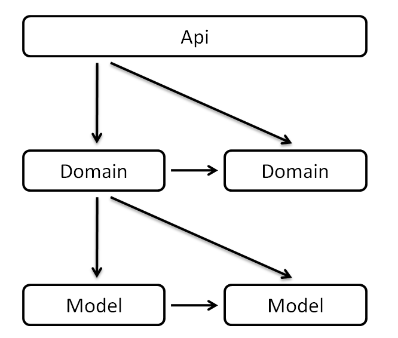

## 开发规范

Api接口服务层应该做：

- 应该：对用户登录态进行必要的检测
- 应该：控制业务场景的主流程，创建领域业务实例，并进行调用
- 应该：进行必要的日记纪录
- 应该：返回接口结果
- 应该：调度领域业务层

Api接口服务层不应该做：

- 不应该：进行业务规则的处理或者计算
- 不应该：关心数据是否使用缓存，或进行缓存相关的直接操作
- 不应该：直接操作数据库
- 不应该：将多个接口合并在一起

Domain领域业务层应该做：

- 应该：体现特定领域的业务规则
- 应该：对数据进行逻辑上的处理
- 应该：调度数据模型层或其他领域业务层

Domain领域业务层不应该做：

- 不应该：直接实现数据的操作，如添加并实现缓存机制

Model数据模型层应该：

- 应该：进行数据库的操作
- 应该：实现缓存机制

在明确了上面应该做的和不应该做的，并且也完成了接口的定义，还有验收测序驱动开发的场景准备后，相信这时，即使是新手也可以编写出高质量的接口代码。因为他会受到约束，他知道他需要做什么，主要他按照限定的开发流程和约定稍加努力即可。

如果真的这样，相信我们也就慢慢能体会到精益开发的乐趣。

至于调用关系，整体上讲，应根据从Api接口层、Domain领域层再到Model数据源层的顺序进行开发。

在开发过程中，需要注意不能**越层调用**也不能**逆向调用**，即不能Api调用Model。而应该是**上层调用下层，或者同层级调用**，也就是说，我们应该：

- Api层调用Domain层
- Domain层调用Domain层
- Domain层调用Model层
- Model层调用Model层

如果用一张图来表示，则是：

为了更明确调用的关系，以下调用是**错误**的：

- 错误的做法1：Api层直接调用Model层

- 错误的做法2: Domain层调用Api层，也不应用将Api层对象传递给Domain层

- 错误的做法3: Model层调用Domain层

  

这样的约定，便于我们形成统一的开发规范，降低学习维护成本。比如需要添加缓存，我们知道应该定位到Model层数据源进行扩展；若发现业务规则处理不当，则应该进入Domain层探其究竟；如果需要对接口的参数进行调整，即使是新手也知道应该找到对应的Api文件进行改动。  